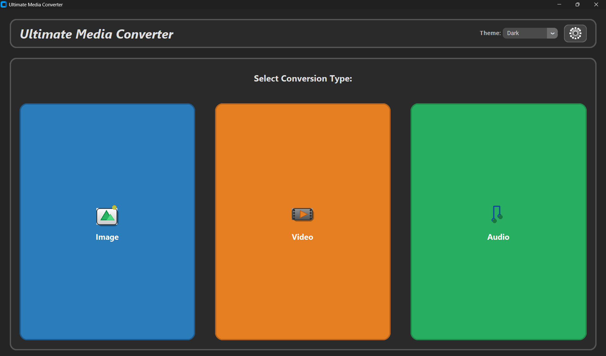
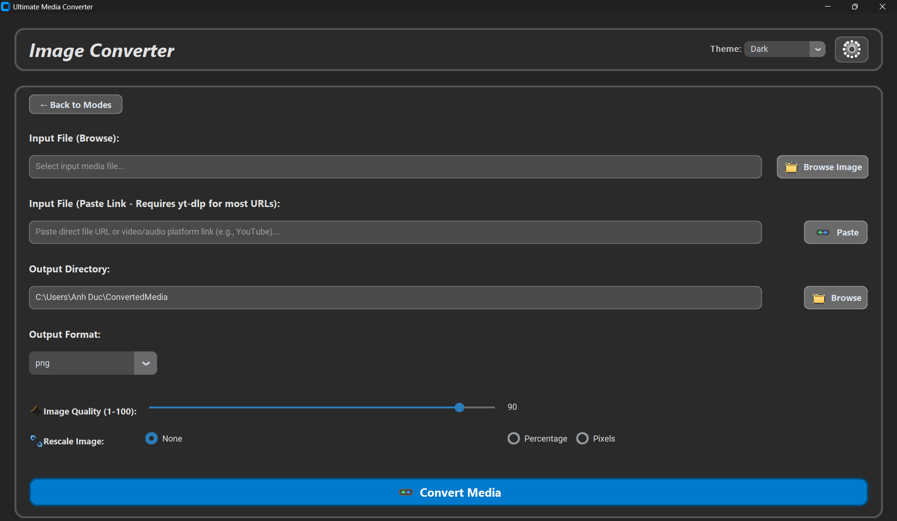
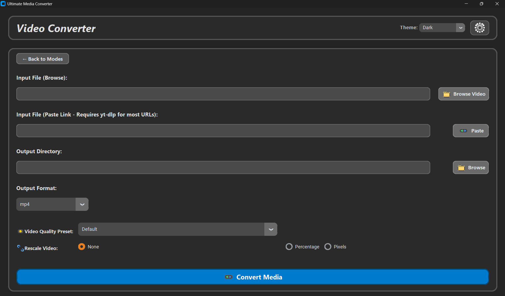
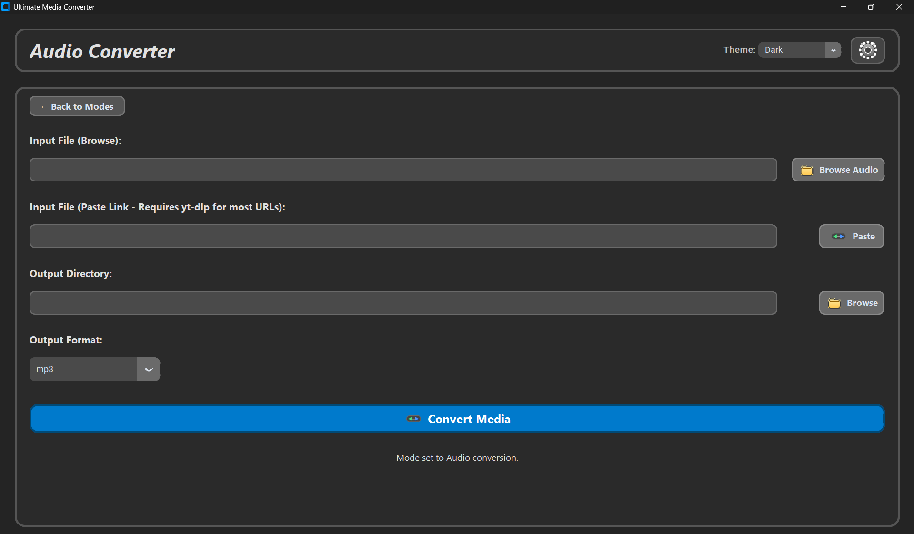
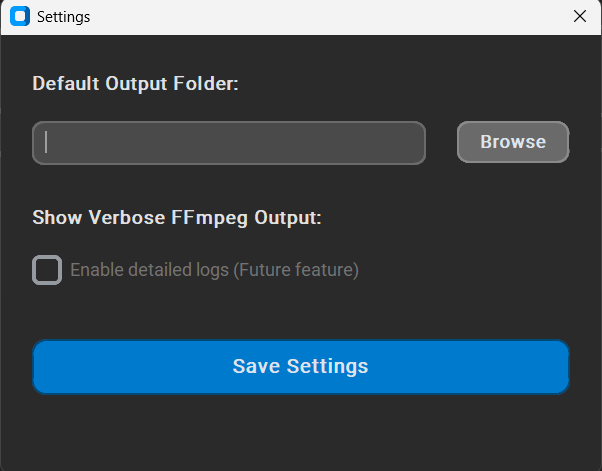
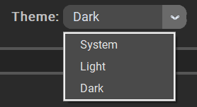

# Ultimate Media Converter

The Ultimate Media Converter is a powerful and user-friendly desktop application built with Python and CustomTkinter, designed to simplify your media conversion tasks. Whether you need to convert images, videos, or audio files, or even download media directly from URLs, this tool provides a modern and intuitive interface with advanced customization options.

## ✨ Features

* **Multi-Format Support:** Convert between a wide range of image, video, and audio formats.
    * **Images:** `png`, `jpg`, `jpeg`, `webp`, `gif`, `bmp`, `ico`, `tiff`, `psd`, `eps`, `avif`, `icns`
    * **Videos:** `mp4`, `mov`, `avi`, `mkv`, `webm`, `3gp`, `3g2`, `3gpp`, `cavs`, `dv`, `dvr`, `flv`, `m2ts`, `m4v`, `mpeg`, `mpg`, `mts`, `mxf`, `ogg`, `rm`, `rmvb`
    * **Audio:** `mp3`, `wav`, `aac`, `flac`, `ogg`, `aif`, `aiff`, `aifc`, `amr`, `au`, `caf`, `dss`, `m4a`, `m4b`, `oga`, `voc`, `weba`, `wma`, `ac3`
* **Image Customization:**
    * Adjust output image quality (1-100).
    * Rescale images by percentage or specific pixel dimensions (width/height).
* **Video Customization:**
    * Select predefined video quality presets (e.g., 1080p, 720p, 480p, or CRF-based quality).
    * Rescale videos by percentage or specific pixel dimensions (width/height).
* **URL Download & Convert:** Paste a media URL (e.g., YouTube video, direct image link) to automatically download and convert it to your desired format.
* **Intuitive GUI:** A clean, modern, and responsive user interface with dynamic options based on the selected media type.
* **Dark/Light Theme:** Switch between system, light, and dark appearance modes.
* **Customizable Output Directory:** Set a default output folder for all conversions.

## 📸 Screenshots

Here are some screenshots showcasing the application's interface and features:

* **Main Mode Selection:**
    
* **Image Conversion Options:**
    
* **Video Conversion Options:**
    
* **Audio Conversion Options:**
    
* **Settings Window:**
    
* **Theme Selection:**
    

## ⚙️ Installation

To run the Ultimate Media Converter, you'll need Python installed on your system, along with a few libraries and external tools.

### 1. Clone the Repository

```bash
git clone [https://github.com/YOUR_USERNAME/Ultimate-Media-Converter.git](https://github.com/YOUR_USERNAME/Ultimate-Media-Converter.git)
cd Ultimate-Media-Converter
```

### 2. Install Python Dependencies

It's recommended to use a virtual environment.

```bash
python -m venv venv
# On Windows:
.\venv\Scripts\activate
# On macOS/Linux:
source venv/bin/activate

pip install -r requirements.txt
# If requirements.txt is not provided, install manually:
pip install customtkinter Pillow requests
```

### 3. Install FFmpeg

FFmpeg is essential for media conversion.

* **Windows:**
    1.  Download a static build from [ffmpeg.org/download.html](https://ffmpeg.org/download.html) (e.g., from gyan.dev or BtbN).
    2.  Extract the archive and add the `bin` folder (e.g., `C:\ffmpeg\bin`) to your system's PATH environment variable.
    3.  Verify installation by opening a new Command Prompt and typing `ffmpeg -version`.
* **macOS:**
    ```bash
    brew install ffmpeg
    ```
* **Linux (Ubuntu/Debian):**
    ```bash
    sudo apt update
    sudo apt install ffmpeg
    ```

### 4. Install yt-dlp (for URL downloads)

`yt-dlp` is used to download media from various online platforms.

```bash
pip install yt-dlp
# Or if you prefer a standalone executable:
# Download from [https://github.com/yt-dlp/yt-dlp/releases](https://github.com/yt-dlp/yt-dlp/releases)
# Place the executable in a directory included in your system's PATH.
```

### 5. Generate Application Icons

The application uses custom icons. You need to run the `icon_generate.py` script once to create these image files in the same directory as `media_converter_app.py`.

```bash
python icon_generate.py
```

## 🚀 Usage

1.  **Launch the Application:**
    Ensure your virtual environment is activated (if you created one) and run the main application script:
    ```bash
    python media_converter_app.py
    ```

2.  **Select Conversion Type:**
    On the main screen, choose whether you want to convert an **Image**, **Video**, or **Audio** file.

3.  **Provide Input:**
    * **Browse:** Click "Browse" to select a local media file from your computer.
    * **Paste Link:** Paste a URL (e.g., a YouTube video link or a direct image URL) into the "Paste Link" field. The application will attempt to download the media first.

4.  **Choose Output Directory:**
    Click "Browse" next to "Output Directory" to select where you want to save your converted file. You can also set a default output directory in the Settings.

5.  **Select Output Format:**
    Choose your desired output format from the dropdown menu. The available formats will change based on your selected conversion type (Image, Video, or Audio).

6.  **Adjust Options (Image/Video):**
    * **Image:** Use the "Image Quality" slider (for JPG/WEBP) and "Rescale Image" options (Percentage or Pixels) to customize the output.
    * **Video:** Select a "Video Quality Preset" or use "Rescale Video" options (Percentage or Pixels) to customize.

7.  **Convert:**
    Click the "Convert Media" button to start the conversion process. A status message at the bottom will keep you updated.

8.  **Settings:**
    Click the gear icon in the top right corner to open the settings window. Here you can:
    * Change the default output folder.
    * (Future) Toggle verbose FFmpeg output for detailed logs.

## 🤝 Contributing

Contributions are welcome! If you have suggestions for improvements, new features, or bug fixes, please feel free to:

1.  Fork the repository.
2.  Create a new branch (`git checkout -b feature/your-feature-name`).
3.  Make your changes.
4.  Commit your changes (`git commit -m 'Add new feature'`).
5.  Push to the branch (`git push origin feature/your-feature-name`).
6.  Open a Pull Request.

## 📄 License

This project is licensed under the MIT License - see the [LICENSE](LICENSE) file for details.
